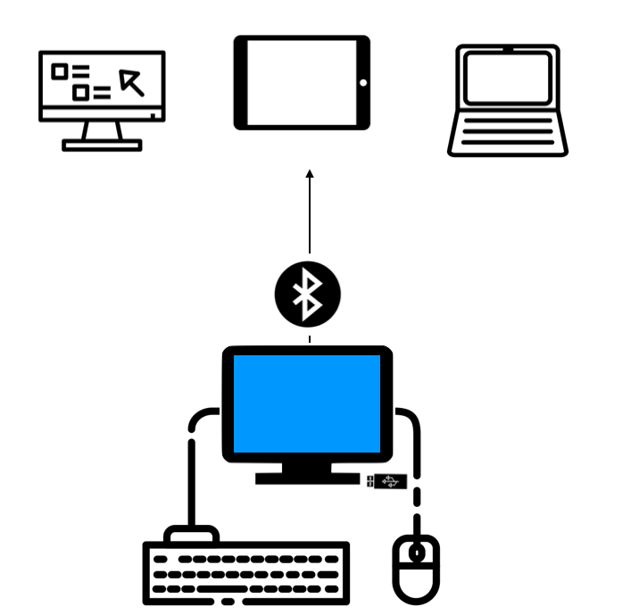

# ⚙️ Installation

> The easiest way to get up-and-running is with the [Windows Installer](https://github.com/AceCentre/RelayKeys/releases/latest), which includes the RelayKeys-CLI, and the RelayKeys-Desktop software. Read on to see how to install and setup.

## A quick reminder of how this works

So RelayKeys consists of a hardware solution that talks Bluetooth HID to secondary devices - anything that can pair with bluetooth and understand a keyboard works, and some software on the 'server' device; i.e. the device sending the key/mouse movements. So for our installation we really focus on the 'server' since the recieving device needs no additional hardware or software.

## Requirements

RelayKeys is designed to work on Windows, Linux, and Mac Operating Systems. We have built a Windows installer that makes the process easier on that platform. For Mac & Linux, you will need to build the app from the source.

* **Windows 7-10**
* **A USB Port**
* **Ability to Install the software as Administrator**
* **A second device to connect to** Could be a Windows computer, a Mac, an iPad etc

and most importantly:

* **A supported piece of RelayKeys-ready hardware**
  * Right now: this is designed to work with the [Adafruit nrf52840 express](https://www.adafruit.com/product/4062), [Adafruit nrf52840 Itsybitsy](https://www.adafruit.com/product/4481) or  [Raytac nrf52840 dongle](https://www.adafruit.com/product/5199) Others will be added to the list as this is developed.
  * **Note**: if you wish to use a dongle to receive - instead of relying on a device's internal Bluetooth and pairing etc - you will need a second board.

