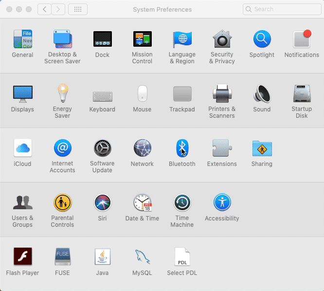

# Kabelgebundener Modus

## Schließen Sie Ihren RelayKeys-Stick an und verbinden Sie ihn mit einem Computer (kabelgebundener Modus)

1. Vergewissern Sie sich, dass der Micro-USB-Stecker mit dem Stick verbunden ist, und schließen Sie dann das weibliche Ende des USB-Kabels an Ihren Computer an.
2. Ihr Stick sollte durchgehend blau leuchten ("Gekoppelt") oder blau blinken ("Nicht gekoppelt").

Wenn "Blinkt". Dies bedeutet, dass Sie das RelayKeys-Gerät noch mit einem anderen Computer koppeln müssen.

### RelayKeys in einen Pairing-Modus versetzen

Sie können dies auf drei verschiedene Arten tun:

* Senden Sie einen Befehl mit der Anwendung "`relaykeys-QT.exe`" und drücken Sie "Gerät hinzufügen" in der Symbolleiste - oder -
* Führen Sie "`relaykeys-cli.exe ble_cmd:devadd" aus - oder -`
* Drücken Sie die Taste auf der RelayKeys-Hardware. Sie wird nun <mark style="background-color:yellow;">gelb</mark> blinken.
* Koppeln Sie nun Ihr Gerät mit RelayKeys.

### Koppeln mit einem Windows-Computer

Um eine Verbindung zu einem anderen Windows-Computer herzustellen, gehen Sie zu Einstellungen, Bluetooth, "Gerät hinzufügen", und verbinden Sie sich mit "AceRK".

### Koppeln mit einem iOS-Gerät

Um eine Verbindung mit einem iPad/iPhone herzustellen, gehen Sie zu Einstellungen, Bluetooth und fügen Sie "Bluefruit52" oder "AceRK" oder "RelayKeys" hinzu.
[iPad koppeln](../../img/screenshots/ipad-pairing.gif)

### Koppeln mit einem Mac

Um eine Verbindung zu einem Mac herzustellen, öffnen Sie "Systemeinstellungen", Bluetooth und fügen Sie "AceRK" hinzu.

##