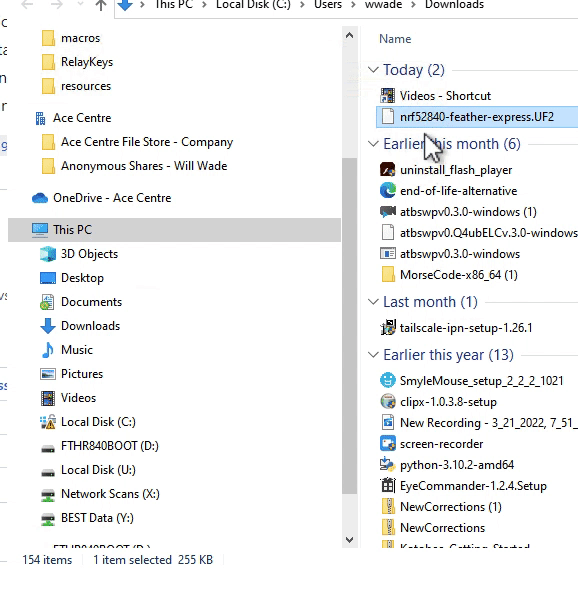

# Adafruit Feather nRF52840 Express

.png>)

Verwenden Sie entweder die UF2-Methode (Ziehen und Ablegen) oder die mehr Schritte umfassende Arduino-Upload-Methode.
Für die UF2-Methode

* Laden Sie die UF2-Datei für die Feder _nrf52840_ express _board in der_ [_aktuellen Version_](http://github.com/acecentre/relaykeys/releases/latest)__ herunter.
* Doppelklicken Sie auf die Reset-Taste. Sie erhalten dann ein USB-Laufwerk auf Ihrem Computer. Ziehen Sie die UF2-Datei per Drag & Drop in das Stammverzeichnis dieses Laufwerks.
* Bei Erfolg **SOLLTE** die Verbindung zu Ihrem Computer getrennt werden und das Licht sollte grün leuchten.
* Weitere Einzelheiten finden Sie in den Schritten [hier] (https://learn.adafruit.com/adafruit-metro-m0-express/uf2-bootloader-details#entering-bootloader-mode-2929745)

Oder die Arduino-Upload-Methode.

* Überprüfen Sie die Einstellungen Ihrer [Arduino IDE](https://learn.adafruit.com/bluefruit-nrf52-feather-learning-guide/arduino-bsp-setup) (denken Sie daran, dass wir das nRF52840-Board verwenden!)
* Laden Sie den [sketch](../../../arduino/arduino_nRF52840/arduino_nRF52840.ino) auf Ihre Feder hoch.
* Führen Sie den serverseitigen Code aus.
* Geschafft!