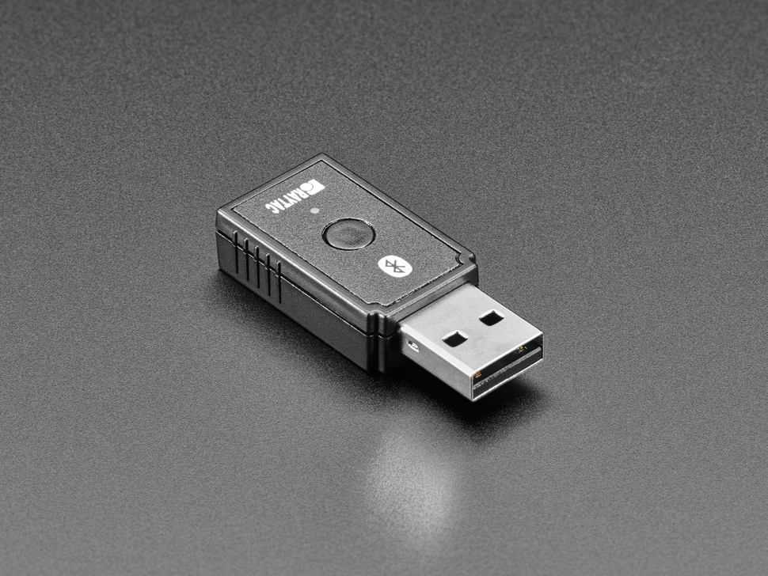

# Raytac-Dongle

Verwenden Sie entweder die UF2-Methode (Ziehen und Ablegen) oder die mehr Schritte umfassende Arduino-Upload-Methode.
Für die UF2-Methode

* Laden Sie die UF2-Datei für den raytac-Dongle in der_ [_aktuellen Version_](http://github.com/acecentre/relaykeys/releases/latest)__ herunter.
* Halten Sie die Reset-Taste gedrückt, während Sie den Dongle an den Computer anschließen. Sie erhalten dann ein USB-Laufwerk auf Ihrem Computer. Ziehen Sie die UF2-Datei per Drag & Drop in das Stammverzeichnis dieses Laufwerks.

Oder die Arduino-Upload-Methode.

* Überprüfen Sie die Einstellungen Ihrer [Arduino IDE](https://learn.adafruit.com/bluefruit-nrf52-feather-learning-guide/arduino-bsp-setup) (denken Sie daran, dass wir das nRF52840-Board verwenden!)
* Laden Sie den [sketch](../../../arduino/arduino_nRF52840/arduino_nRF52840.ino) auf Ihre Feder hoch.
* Führen Sie den serverseitigen Code aus.
* Geschafft!