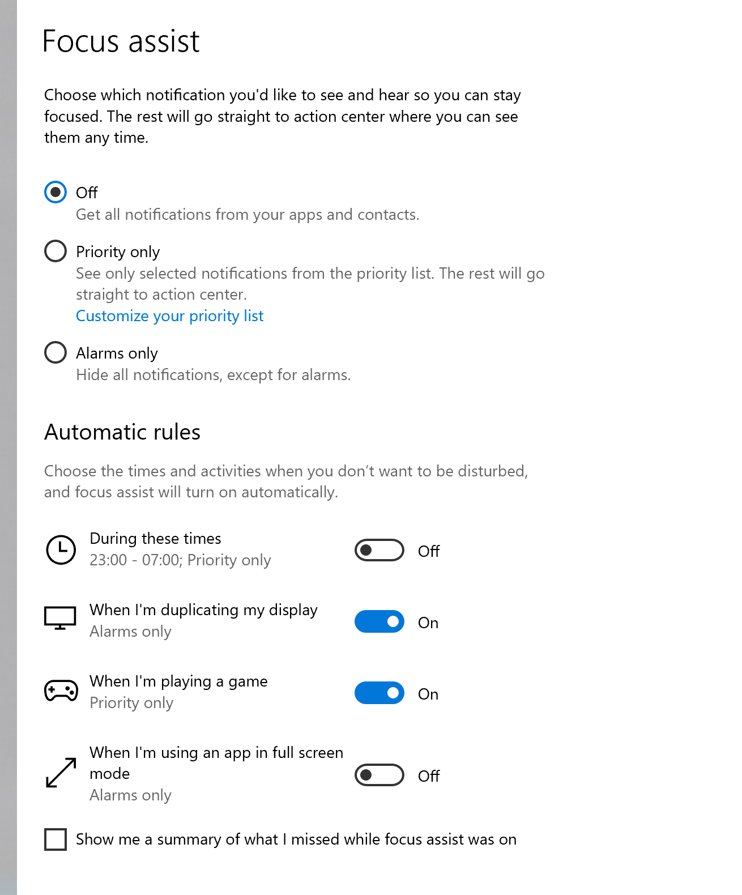

# 💬 Leitfäden zur Verwendung mit Unterstützter Kommunikation


Dies ist für Endbenutzer. Wenn Sie ein Entwickler sind, ziehen Sie bitte in Betracht, mit RelayKeys über die [serial](../relaykeys-serial.md) oder [cli API.](../relaykeys-cli.md) zu kommunizieren.



Im Moment konzentrieren wir uns auf Windows AAC Software. Für iOS oder Android muss ein Entwickler Relaykeys unterstützen, damit es funktioniert.


Die meiste AAC-Software hat eine Möglichkeit, sich mit einer externen Anwendung zu verbinden. Manche nennen dies "Programm ausführen" oder etwas Ähnliches. Solange RelayKeys installiert und die richtige Hardware angeschlossen ist, können Sie die installierte Kommandozeilenanwendung aufrufen - mit [der richtigen Syntax](../../../technical/reference.html).

Werfen Sie einen Blick in die Anleitungen für Ihre Software.

Die Schlüsselanwendung, auf die Sie zugreifen möchten, ist `relaykeys-cli-win.exe`, zu finden unter `C:\Program Files (x86)\Ace Centre\RelayKeys`.
Eine vollständige Liste der Befehle, die Sie senden können, finden Sie [hier] (../relaykeys-cli.md).

Übersetzt mit www.DeepL.com/Translator (kostenlose Version)

### Ein Tipp zu Benachrichtigungen

Wenn Sie die Flagge _--notify_ an die cli-Anwendung übergeben, erhalten Sie Benachrichtigungen über die Geräte, mit denen Sie verbunden sind, und den Status des Geräts. Siehe [hier](../relaykeys-cli.md#optional-extra-flag-notfiy) für weitere Informationen

Es gibt keine dokumentierte Möglichkeit für Dritte, ihre Software in kommerzielle AAC-Software zu integrieren, z.B. integrierte Benachrichtigungen. Also müssen wir das Benachrichtigungssystem des Betriebssystems nutzen. Die Schwierigkeit unter Windows ist, dass Vollbildanwendungen standardmäßig keine Benachrichtigungen sehen. Damit dies funktioniert, empfehlen wir drei Änderungen an Ihren Benachrichtigungen.

1. Schalten Sie den Fokus-Assistenten **aus**.
2. Schalten Sie die Einstellung "Wenn ich eine Anwendung im Vollbildmodus verwende" **aus**.

Und als Nächstes - weil unterstützt kommunizierende Nutzer normalerweise nicht in der Lage sind, Benachrichtigungen zu entlassen, ändern Sie die Zeit, für die sie angezeigt werden. Befolgen Sie dazu die Schritte [hier](https://www.tenforums.com/tutorials/6175-change-how-long-show-notifications-windows-10-a.html).

Übersetzt mit www.DeepL.com/Translator (kostenlose Version)