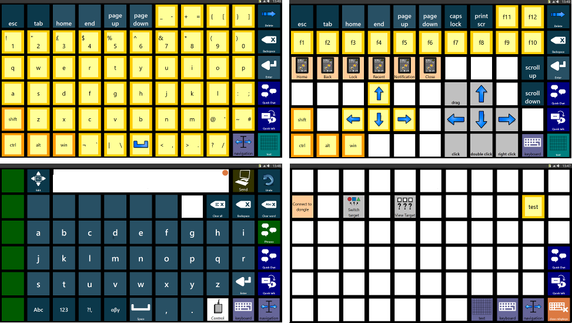
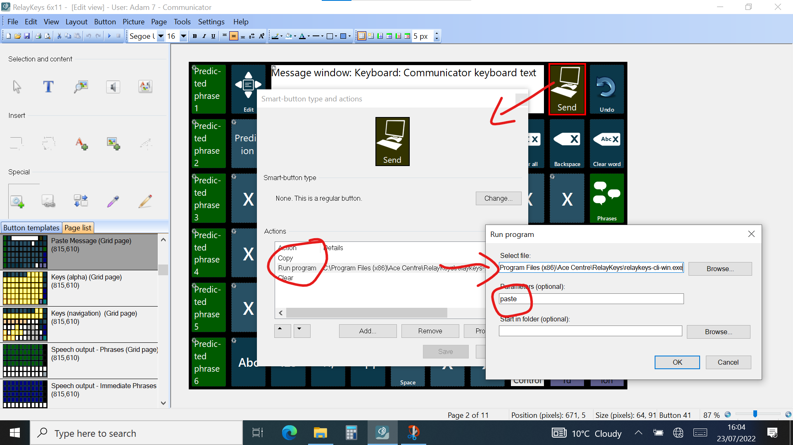
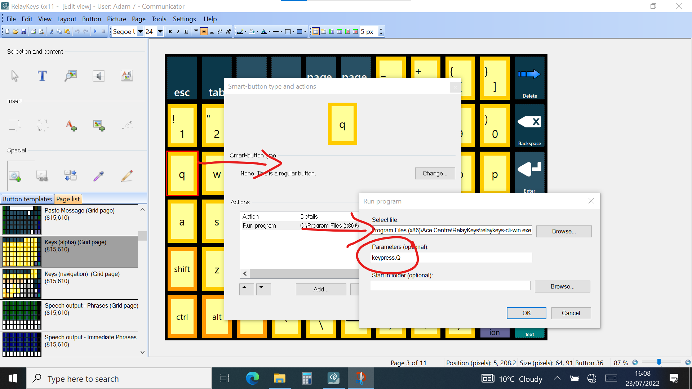
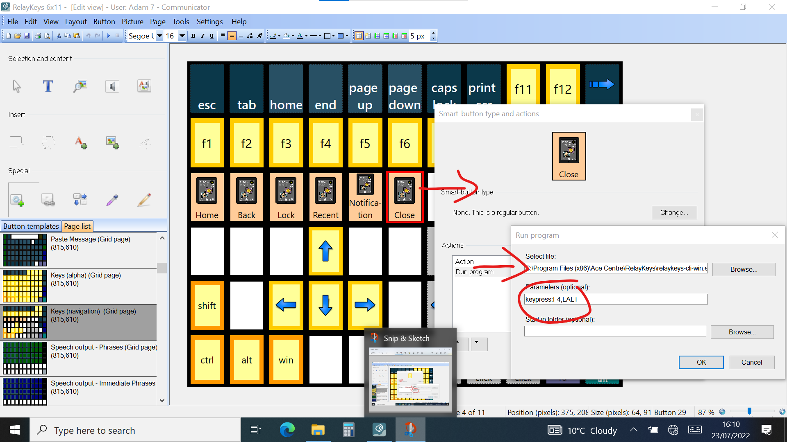
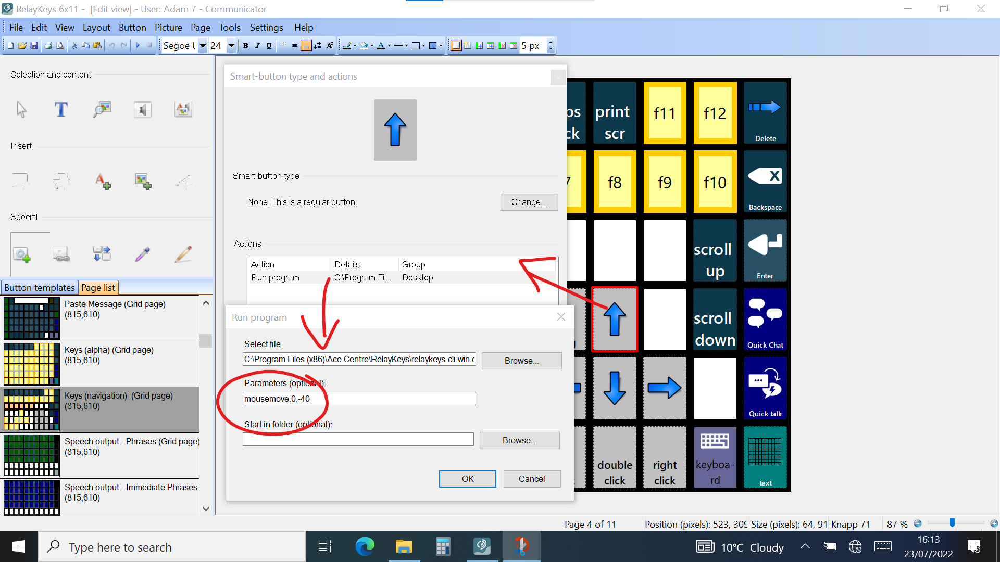
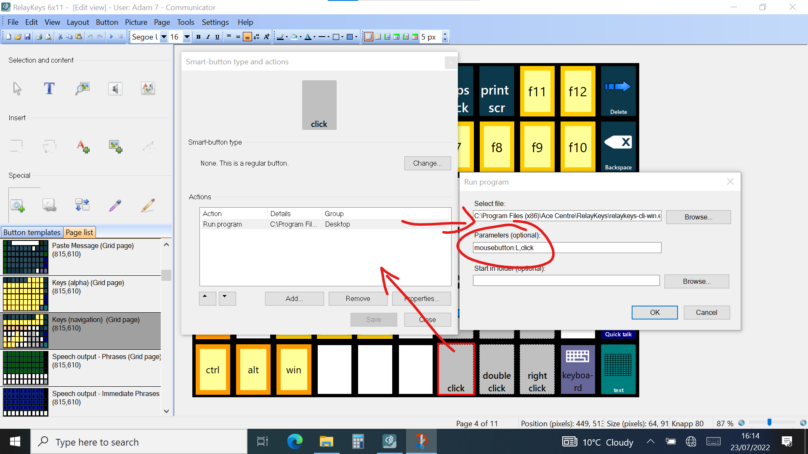
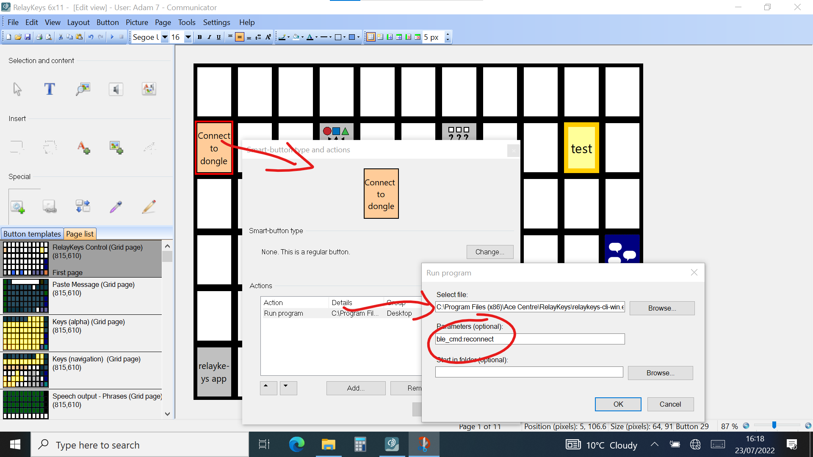
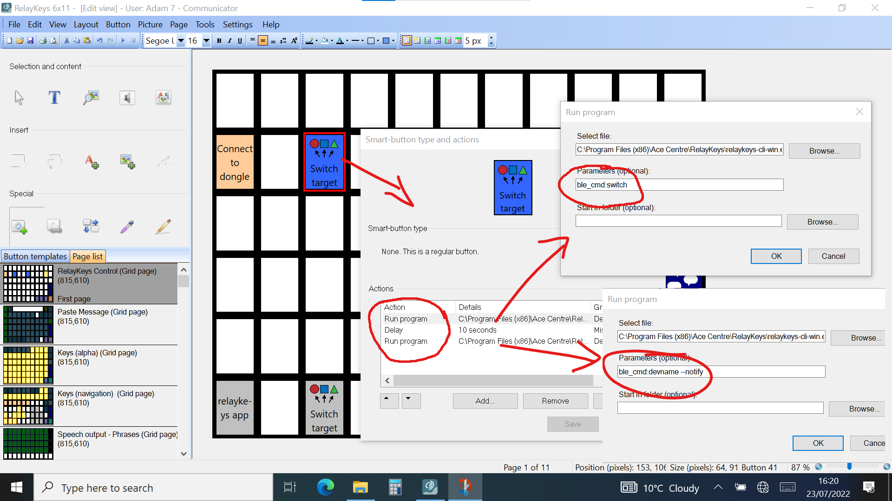

# Tobii Communicator 5

[Communicator 5](https://www.tobiidynavox.com/pages/communicator-5-ap) ist eine Software für Unterstützte Kommunikation für Tobii Dynavox Kommunikationshilfen. Führen Sie die folgenden Schritte aus, um Befehle zu Ihrem Seitensatz hinzuzufügen


Pageset Schnellstart. Wollen Sie einen Vorsprung haben? Laden Sie das Pageset [hier] herunter (../../../resources/aac-software/RelayKeys6x11.cddx). Es enthält alle Befehle, die Sie brauchen sollten. Importieren Sie einfach, fügen Sie das Pageset zu Ihrer Homepage hinzu und passen Sie es an



## Versenden der Nachrichtenleiste

Dies ist der beste Weg, um längere Texte einzugeben, und ermöglicht es Ihnen, die Vorhersage- und Phrasenspeicher der Kommunikationshilfe usw. zu nutzen. Verwenden Sie den Befehl "Kopieren" gefolgt vom Befehl Programm ausführen, um relaykeys-cli-win.exe mit dem Argument **Einfügen** auszuführen

## Einfache Tastenanschläge

Dies ist nützlich, um eine tastaturähnliche Seite mit einzelnen Buchstaben und anderen Tasten zu erstellen, die einen Tastendruck nach dem anderen senden. Verwenden Sie den Befehl Programm ausführen, um relaykeys-cli-win.exe mit dem Argument **keypress:LETTER** auszuführen (wobei letter die Taste ist, die Sie senden möchten)

## Senden von Tastaturkürzeln

Für spezielle Befehle und Tastenkombinationen wie Control-C, Alt-F4 usw. verwenden Sie den Befehl Programm ausführen, um relaykeys-cli-win.exe mit dem Argument **keypress:KEYNAME,MODIFIER** auszuführen (wobei keyname die Taste ist, die Sie senden möchten)

## Senden von Mausbefehlen

Verwenden Sie den Befehl Programm ausführen, um relaykeys-cli-win.exe mit dem Argument **mousemove:X,Y** (wobei X,Y der Abstand ist, um den Sie die Maus bewegen möchten) oder dem Argument **mousebutton:BUTTON,ACTION** (wobei BUTTON die zu verwendende Taste und ACTION ein Klick oder Doppelklick usw. ist) auszuführen.

## Steuerung von RelayKeys

Verwenden Sie den Befehl Programm ausführen, um relaykeys-cli-win.exe mit den Befehlen ble-cmd:reconnect, ble-cmd:switch oder ble-cmd:devname --notify auszuführen

