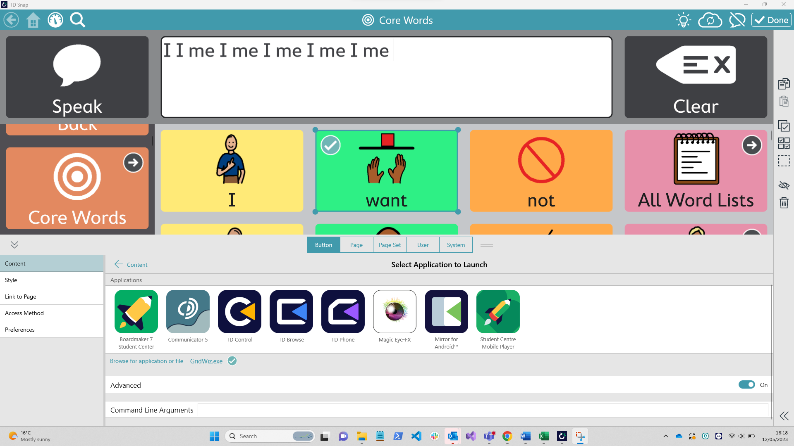
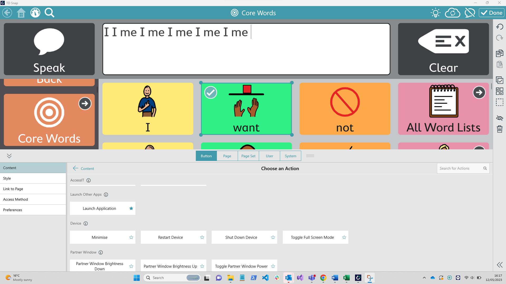
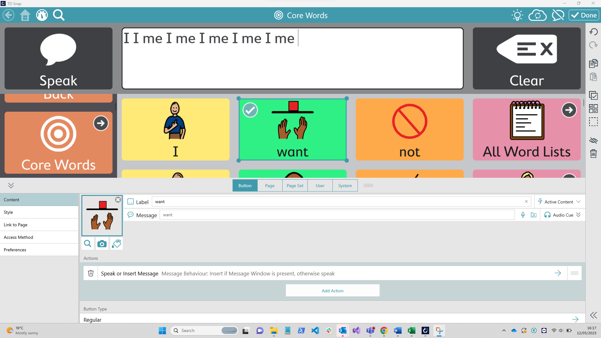

# Tobii Dynavox - Snap

Bevor Sie RelayKeys mit Snap verwenden, haben Sie [AccessIT 3] (https://www.tobiidynavox.com/products/accessit-3) in Betracht gezogen? Es ist für TD Software verfügbar und ist gut! Es gibt ein paar Probleme - es ist nicht mit mehreren Geräten kompatibel und der Dongle muss eingesteckt sein;

## Hinzufügen einer Aktion - Aufruf von Relaykeys

Sie müssen Ihr Snap-Seitenset bearbeiten - und eine Schaltfläche "Allgemein" erstellen - dann können Sie eine Aktion zu einer Schaltfläche hinzufügen. Die Aktion&#x20;

<figure><figcaption></figcaption></figure>

<figure><figcaption></figcaption></figure>

<figure><figcaption></figcaption></figure>