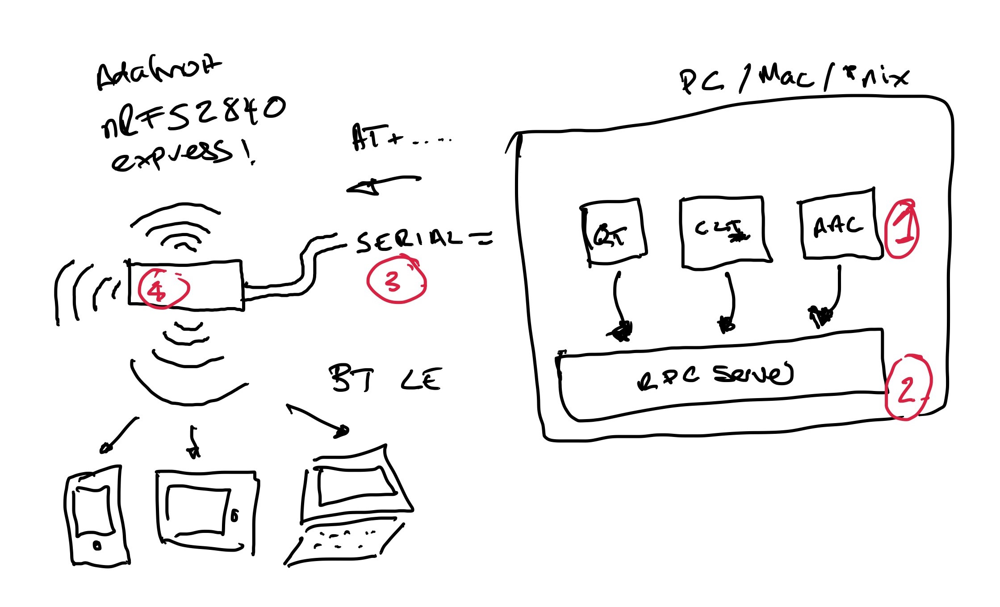

Architecture of RelayKeys
===========================

RelayKeys is a mixture of a Open Hardware board that communicates in Bluetooth LE (4), a RPC server (2) to communicate over serial to the board (3) and then RPC clients (1) such as the relaykeys-cli and relaykeys-qt applications. The Arduino based board is currently a **Adafruit nrf52840 express**. We use this board as it has very nice low level **AT** Commands we can talk to emulate **all** keyboard keys and their modifiers - as well as functions found on other common BT LE devices such as media keys. In short, **Adafruit have done the hardwork for us and its reliable**. 

## Anatomy of the files

* ``arduino/`` - firmware for the arduino board
* ``docs/``  - VuePress docs for http://acecentre.github.io/relayKeys/. Build Script is **docs-deploy.sh**
* ``resources/`` - Helper files for development (e.g. ``demoSerial.py`` which pretends to be an arduino board connected, viewComPorts which outputs the connected com ports), AAC software pagesets and all-keys.txt which is a output of all the keys supported by RelayKeys. Also note the development files - ``relaykeys-pygame`` and ``relaykeys.py`` - which are stripped down versions of the whole project. Useful for debugging and testing things without the daemon server. Just move ``relaykeys.py`` into the root directory to get it to work. 
* ``blehid.py`` - Library/Import file used by relaykeysd. Includes the function that writes the AT command to the serial port, init the serial port, and sends keyboard/mouse codes. 
* ``build.py``, ``buildinstaller.nsi`` - Build files to turn this project into a installer. Run ``python build.py`` to trigger the build. 
* ``docs-deploy.sh`` - deploys the documentation to the github pages site. 
* ``relaykeys-cli.py`` - This is the command line interface version of relaykeys. Conencts to the daemon server. 
* ``relaykeys-example.cfg`` - The default config file. Note this gets copied on install to the right location and is used as the standard config. Note commented out baud and dev lines. Dev fixes the ``COM`` port if the com port finding code doesn't work
* ``relaykeys-qt.py`` - The GUI version of our relakeys testing app. 
* ``relaykeys.spec.ini`` - Used for the NSIS build (i.e. ``buildinstaller.nsi``)
* ``relaykeysclient.py`` - The main library file used by -cli and -qt versions. Connects to the server. 
*  ``relaykeysd-service-restart.bat``, ``relaykeysd-service.py`` - The Windows service applcation
* ``relaykeysd.py`` - The daemon. This is what is run in the background - and controlled by the service. If you want to test RelayKeys - run this file first - and leave it running. e.g. ``python relakyeysd.py &&``. Note the command line flags in the header. 

## Steps to run RelayKeys (non-installer method) - Windows

*Prerequisites*

* [Install Python 3](https://www.python.org/downloads/windows/)
* Have access to a nrf52840 arduino board. e.g. the Adafruit nrf52840 express

1. Grab a nrf52840 board and load the arduino code onto it. Plug it in a usb slot on your computer 
2. Check your arduino is working as expected. Find and make a note of the COM port it is ([found in the device manager](https://www.sevenforums.com/attachments/hardware-devices/263068d1486601972t-com-port-missing-device-manager-com-port-pic.jpg))
3. Download the code to a sensible location - e.g. ``git clone https://github.com/AceCentre/RelayKeys.git``
4. Copy  the ``relaykeys-example.cfg`` file e.g. ``copy relaykeys-example.cfg relaykeys.cfg`` 
5. Install requirements e.g. ``pip install -r requirements.txt``
6. Run the Daemon code. ``python relaykeysd.py``
7. Pair your relaykeys arduino with a PC/Mac/iOS/Android device and open a text file
8. Test it out with the cli file e.g. ``python relaykeys-cli.py type:Hello``

You should, if everything is working as expected, see it type on the second device. If not have a look at the log files. 

One problem may be that the daemon cant find the COM port. You can fix this by fixing the com port you found in step 2 and putting it in the config file. e.g. add ``dev=COM6`` if the com port is 6. 

