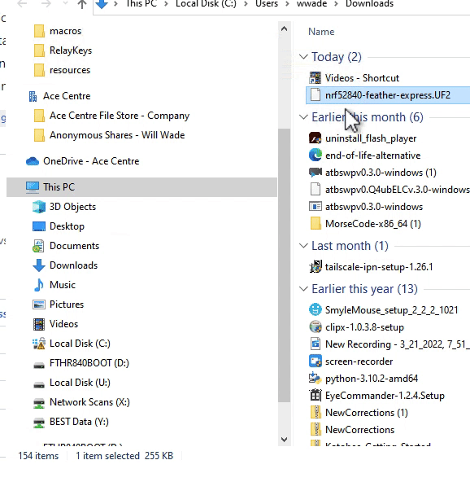

# Supported Electronics Boards

A wide range of Arduino boards supports HID (Human Interface Device). Often these are to emulate simple keypress' but to do more complex things like send one or modififer keys with a key - or to emulate holding a key down for a set period of time is either impossible or difficult to implement. Adafruit have developed the firmware on their Bluefruit nrf\* range of boards to emulate HID keyboards well using their AT Commands.

Currently RelayKeys is designed to work with the [Adafruit Feather nRF52840 Express](https://www.adafruit.com/product/4062) (Buy in the [UK from Pimoroni](https://shop.pimoroni.com/products/adafruit-feather-nrf52840-express)) or with the [Adafruit itsybitsy nrf52840 ](https://www.adafruit.com/product/4481)or with lesser support for the [The Adafruit - Bluefruit LE Friend - nRF51822 - v3.0](https://www.adafruit.com/product/2267) (Buy in the [UK from Pimoroni](https://shop.pimoroni.com/products/adafruit-bluefruit-le-friend-ble-4-0-nrf51822-v1-0#description)). _Although Note: We really arent supporting the LE Friend much - we do hear it works but dragons beware!_ See below for details on configuring these.


If you are using a receiver dongle - follow the same guidance below but you will also need to copy over the firmware file for the dongle. Same procedure - different file name


## Setup for Adafruit Feather nRF52840 Express

Either use the drag and drop UF2 method or more steps involved - Arduino uploading method.\
\
For the UF2 method

* Download the UF2 file for the feather _nrf52840_ express _board in the_ [_current release_](http://github.com/acecentre/relaykeys/releases/latest)\_\_
* Double click that reset button. You will then get a USB drive on your computer. Drag and drop the UF2 file to the root of that drive.
* It **SHOULD** disconnect from your Computer if successful and the light should change colour to Green
* More details see the steps [here](https://learn.adafruit.com/adafruit-metro-m0-express/uf2-bootloader-details#entering-bootloader-mode-2929745)



Or the Arduino uploading method.

* Check the setup of your [Arduino IDE](https://learn.adafruit.com/bluefruit-nrf52-feather-learning-guide/arduino-bsp-setup) (remember we're using the nRF52840 board!)
* Upload the [sketch](../../arduino/arduino\_nRF52840/arduino\_nRF52840.ino) to your feather.
* Run the server side code
* Done!

## Setup for Raytac dongle

Either use the drag and drop UF2 method or more steps involved - Arduino uploading method.\
\
For the UF2 method

* Download the UF2 file for the raytac dongle in the\_ [_current release_](http://github.com/acecentre/relaykeys/releases/latest)\_\_
* Press and hold thr reset button as you plug it into the computer. You will then get a USB drive on your computer. Drag and drop the UF2 file to the root of that drive.


Or the Arduino uploading method.

* Check the setup of your [Arduino IDE](https://learn.adafruit.com/bluefruit-nrf52-feather-learning-guide/arduino-bsp-setup) (remember we're using the nRF52840 board!)
* Upload the [sketch](../../arduino/arduino\_nRF52840/arduino\_nRF52840.ino) to your feather.
* Run the server side code
* Done!

## Setup for Adafruit itsybitsy nRF52840

Either use the drag and drop UF2 method or more steps involved - Arduino uploading method.\
\
For the UF2 method

* Download the UF2 file for the itsybitsy _board in the current release_
* Double click that reset button. You will then get a USB drive on your computer. Drag and drop the UF2 file to the root of that drive.
* It SHOULD disconnect from your pC if successful – but as I say the loghts should change colour to Green
* More details see the steps [here](https://learn.adafruit.com/adafruit-metro-m0-express/uf2-bootloader-details#entering-bootloader-mode-2929745)

Or the Arduino uploading method.

* Check the setup of your [Arduino IDE](https://learn.adafruit.com/bluefruit-nrf52-feather-learning-guide/arduino-bsp-setup) (remember we're using the nRF52840 board!)
* Upload the [sketch](../../arduino/arduino\_nRF52840/arduino\_nRF52840.ino) to your feather.
* Run the server side code
* Done!

## Setup for Bluefruit LE Friend


Although it _should_ work - and we promise you it _did_ work - something has broken functionality working with the LE friend. So we aren't **officially** supporting this right now


* [Install the CP2104 Driver](https://www.silabs.com/products/development-tools/software/usb-to-uart-bridge-vcp-drivers)
* Update it to 0.8.1. Easiest way to do this is to connect to using the Bluefruit app - it will auto update it if required.
* Plug it in
* Set the switch on the device to CMD mode
* Open up a serial terminal and connect to the device (See [here](https://learn.adafruit.com/introducing-adafruit-ble-bluetooth-low-energy-friend/terminal-settings#terraterm-windows-5-2) for exact settings for your Operating System)
*   Turn on HID Mode. More info [here](https://learn.adafruit.com/introducing-adafruit-ble-bluetooth-low-energy-friend/ble-services#at-plus-blehiden-14-31). To be precise - enter this into your serial terminal

    ```
      AT+BLEHIDEN=1

      ATZ 
    ```

(You should see 'OK' after each entry)

*   Next change the default speed. i.e. enter this in your serial terminal:

    ```
      AT+BAUDRATE=115200
    ```
* Next put the device into [DATA mode](https://learn.adafruit.com/introducing-adafruit-ble-bluetooth-low-energy-friend/uart-test#blefriend-configuration-6-3) (slide the switch).
*   Finally - update the relaykeys.cfg file with

    ```
      baud = 115200
      
    ```

(Or whatever speed you so wish)

## Developing without a board?

If you are developing the 'server' side of things and want to try out the code you can run this without any hardware by having a null serial terminal. To do this, in a terminal run:

```
python resources/demoSerial.py
```

then in another terminal run

```
python relayekeysd.py --noserial
```

NB: Only tested on MacOS but should work on any posix system. For Windows simply give a COM port that doesn't exist.
