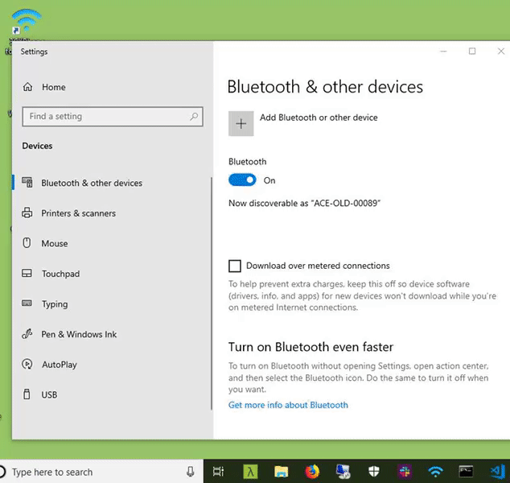
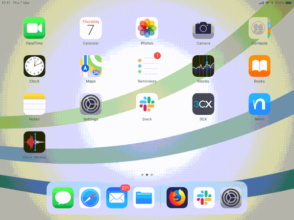
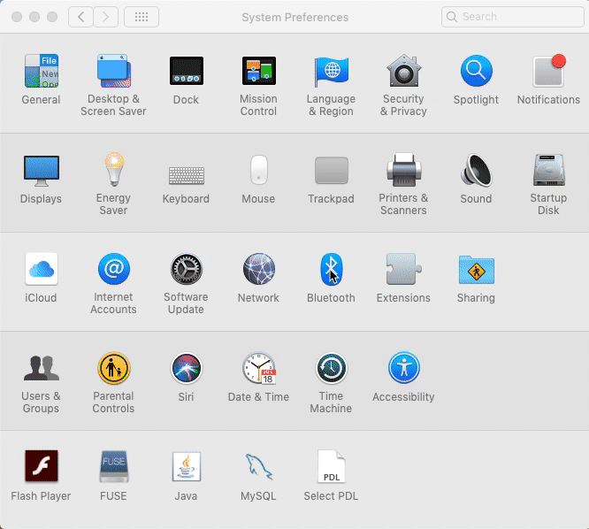

# Wired Mode

## Plug-in Your RelayKeys stick & pair with a computer (Wired mode)

1. Make sure the Micro-USB connector is attached to the stick and then attach the female end of the USB lead into your computer
2. You should see your stick light a solid blue ("Paired") or flashing blue ("Un-paired")

If "Flashing". This means you have yet to pair the RelayKeys device with another computer.

### Put RelayKeys into a pairing mode

You can do this in three different ways:

* Send a command using the "`relaykeys-QT.exe`" app and press "Add a device" in the toolbar - or -
* Run "`relaykeys-cli.exe ble_cmd:devadd" - or -`
* Press the Button on the RelayKeys hardware. It will now flash <mark style="background-color:yellow;">yellow</mark>
* Next pair your device with RelayKeys.

### Pair with a Windows Computer

So to connect to Another Windows computer, go to Settings, Bluetooth, "Add a device", and connect to "AceRK"

### Pair with an iOS device

To connect to an iPad/iPhone, go to Settings, Bluetooth and add "Bluefruit52" or "AceRK" or "RelayKeys"\

### Pair with a Mac

To connect to a mac, Open up "System Preferences", Bluetooth and add "AceRK"

##
