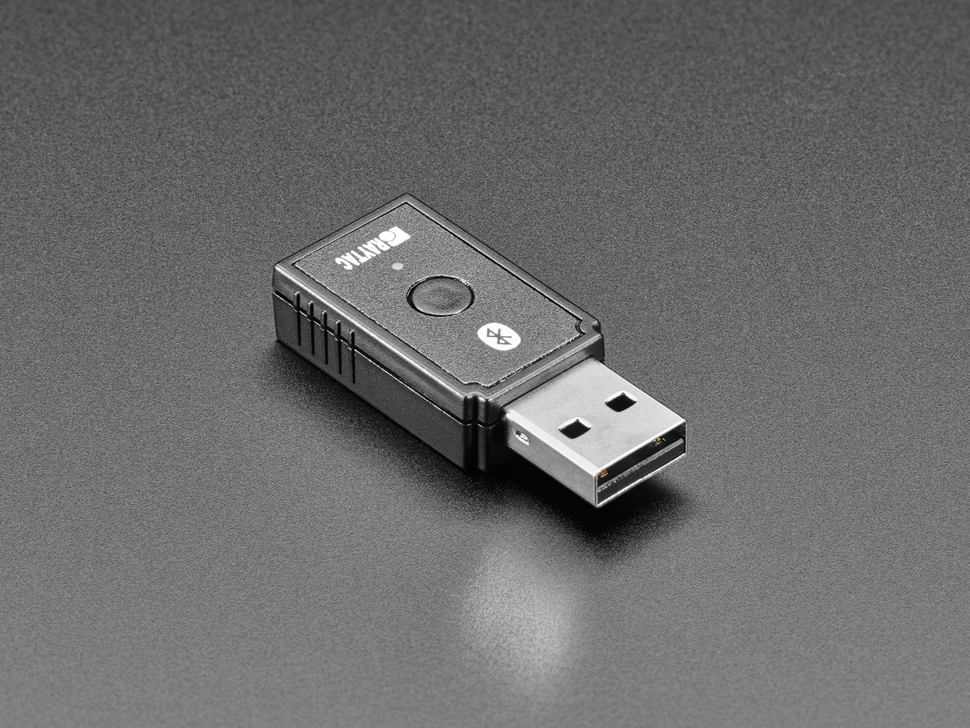

# Setting up a board for RelayKeys


If you have a pre-prepared Bluetooth stick (for example, from Ace Centre), you don't need to read this section. If you are buying your electronics to use, then read on.&#x20;


A wide range of Arduino boards supports HID (Human Interface Device). Often these are to emulate simple keypress' but to do more complex things like send one or modifier keys with a key - or to emulate holding a key down for a set period of time is either impossible or difficult to implement. Adafruit has developed the firmware on their Bluefruit nrf\* range of boards to emulate HID keyboards well using their AT Commands.

Currently, RelayKeys is designed to work with&#x20;

* the Adafruit Raytac nrf52840 dongle  (Buy from [the piHut](https://thepihut.com/products/nrf52840-usb-key-with-tinyuf2-bootloader-bluetooth-low-energy-mdbt50q-rx) or [Digikey](https://www.digikey.co.uk/en/products/detail/adafruit-industries-llc/5199/15189159?s=N4IgTCBcDaILIBEBCAVArABgIoFoBKAGiALoC%2BQA)). Note this is the cleanest looking solution and one of the cheapest. We have pre-prepared firmware for this for both receiving and sending.&#x20;

<figure><figcaption></figcaption></figure>

* [Adafruit Feather nRF52840 Express](https://www.adafruit.com/product/4062) (Buy in the [UK from Pimoroni](https://shop.pimoroni.com/products/adafruit-feather-nrf52840-express)). Note you can use this or the itsybitsy with a battery and have relaykeys work without connecting it directly to your AAC device.&#x20;

<figure><figcaption></figcaption></figure>

* or with the [Adafruit itsybitsy nrf52840 ](https://www.adafruit.com/product/4481)

<figure><figcaption></figcaption></figure>

* or with lesser support for the [The Adafruit - Bluefruit LE Friend - nRF51822 - v3.0](https://www.adafruit.com/product/2267) (Buy in the [UK from Pimoroni](https://shop.pimoroni.com/products/adafruit-bluefruit-le-friend-ble-4-0-nrf51822-v1-0#description)). _Although Note: We really aren't supporting the LE Friend much - we do hear it works, but dragons, beware!_ See below for details on configuring these.


If you are using a receiver dongle - follow the same guidance below but you will also need to copy over the firmware file for the dongle. Same procedure - different file name


Once you have your hardware you need to configure and set them up to work with relaykeys. Read on for how you do this for each device.&#x20;
