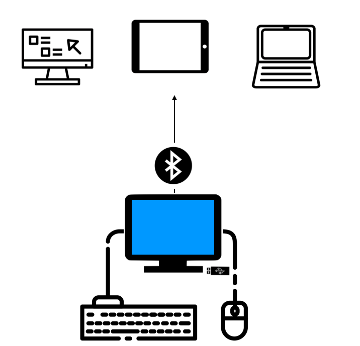

# 🧠 Concepts

> Directus ([duh REKT iss](/img/directus.mp3)) is latin for: _laid straight, arranged in lines_. The broadest goal of Directus is to present data in a simple, orderly, and intuitive way.

## Glossary

Definitions and other various terms that are exclusive to the Directus Ecosystem.

### Alias

A field that does not actually map to a database column (eg: a divider or the one side of a relationship).

### Boilerplate

The base schema and system content included in a fresh/blank copy of Directus.

### Client

An external application using data managed by Directus.

### Collection

A Collection is a grouping of similar Items. Each collection represents a table in your database.

### Collection Preset

Also known as a "bookmark", this is a specific view of a collection assigned to an individual user, a role, or global. It includes:

* Search query
* Filters
* View Type
* Sort Field and Direction
* Layout Query (eg: visible fields)
* Layout Options (eg: tabular column widths)

### Datatype

The SQL vendor-specific database storage type (eg: `VARCHAR`, `BIGINT`, etc)

### Display Template

A Mustache-style string used to format field values. For example:

```
{{first_name}} {{last_name}}, {{title}}
```

### Environment

A flag set in the project config: either `production` or `staging` (not to be confused with deployment environments).

### Extension

Anything that extends the core codebase, including: Interfaces, Pages, Storage Adapters, SSO Services, and more.

### Field

A Field is a specific type of value within a Collection. For example, you might have _Title_, _Body_, _Author_, and _Date Published_ fields within an _Articles_ collection. Each field represents a database column. Saved as a SQL column or alias.

### Field Type

An extended and agnostic storage type mapped to SQL vendor datatypes (eg: `string`, `number`, etc). Also includes non-DB style types that provide extra functionality into the system (eg `m2o`, `translation`, etc).

### Headless CMS

Directus _only manages content_. Unlike traditional CMS, it doesn't come with a website editor, template designs, or "presentation layer" built-in.

### Instance

An API install managing one or more projects on a server.

### Interface

Interfaces allow for different ways of viewing and interacting with field data. These interfaces are primarily used on the edit form of the Item Detail page, but also render readonly data on the Item Browse page.

### Item

A single record of data. Contains values for the fields. Saved as a SQL row.

### Length

The amount/size of data that can be stored in a database column or Directus field.

### Layout

The presentation of data on the Item Browse page. This could be a listing, tiles, calendar, map, chart, or any other way to showcase data.

### Multitenancy

The Directus suite of software has been designed for projects both simple and complex, both small and enormous. To accomodate this, you can install the App and API individually or use the bundled version which combines both. This decoupled approach allows for a single App to manage any number of APIs, even if they are located on different servers. Additionally, each API supports multiple databases, so you only need to install a single instance for all your projects and deployment environments.



::: tip
Feel free to use our always-up-to-date hosted App to connect to any publicly accessible Directus API instance: [https://directus.app](https://directus.app/).
:::

### Note

Descriptive text displayed with a field.

### Project

A database, config, and file storage directory. Also used for deployment environments (eg: `prod`, `stage`, `dev`).

:::tip Reserved Project Names
The following reserved project names can not be used because they represent root-level API endpoints that exist now or may exist in the future:

`server`, `projects`, `interfaces`, `pages`, `layouts`, `types`
:::

### Schema

The SQL database's tables, columns, datatypes, defaults, and other architectual information. This does not include any items or content.

### Versionless

The Directus API is "versionless", which means that new releases will only include fixes and improvements, but no deprecations or breaking changes.
