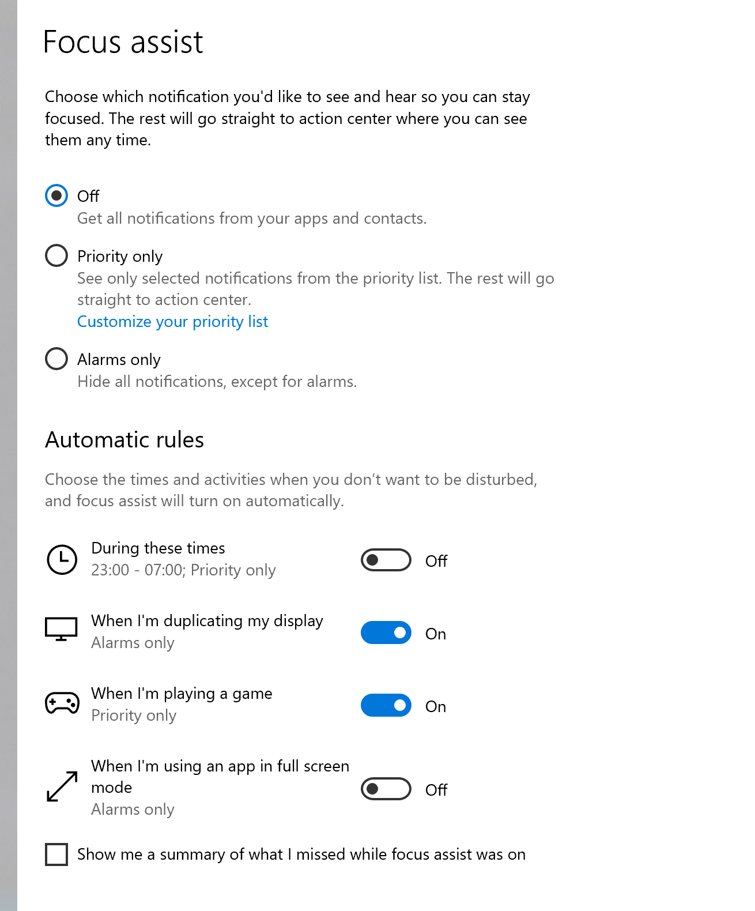

# 💬 Guides for use with AAC


This is for end-users. If you are a developer please consider communicating with RelayKeys over the serial or cli API.



Right now we are focused on Windows AAC Software. We have a roadmap to support iOS and Android OS based Software.


Most AAC software have a way of connecting to an external application. Some call this "Run Programme or something similar. As long as RelayKeys is installed and the correct hardware connected you can then call the installed command line application - with [the correct syntax](../../technical/reference.html).

Take a look at the guides for your software.

The key application you want to access is the `relaykeys-cli-win.exe` found in `C:\Program Files (x86)\Ace Centre\RelayKeys`\
`\` For a full list of commands you can send see [here](../developers/relaykeys-cli.md).

### A tip on notifications

If you pass the --notify flag to the cli application you will get notifications about the devices you are connected to and the status of the device. See [here](../developers/relaykeys-cli.md#optional-extra-flag-notfiy) for more information&#x20;

There is no documented way for third parties integrating their software into commercial AAC software for example integrated notifications. So we have to make use of the operating system notification system. The difficulty on Windows is that by default full screen apps do not see notifications. So to make this work we recommend three alterations to your notifications.&#x20;

1. Turn Focus Assist **off**.
2. Turn **off** the setting "When I'm using an app in full screen mode"

And next - because AAC users wont typically be able to dismiss notifications change the time that they appear for. To do this follow the steps [here](https://www.tenforums.com/tutorials/6175-change-how-long-show-notifications-windows-10-a.html).&#x20;
