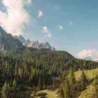
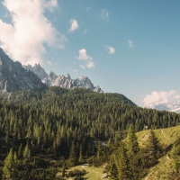

# Thumbnailer

> The Directus Thumbnailer dynamically returns custom thumbnails upon request. To avoid any malicious activity, only thumbnails that are whitelisted within the configuration are allowed.

## URL Syntax

Generating and fetching thumbnails is as easy as requesting them using the following URL syntax:

```url
https://directus.example.com/thumbnail/<project>/<width>/<height>/<action>/<quality>/<filename>
```

### Request Flow

1. A user requests a thumbnail of a specific Directus file using the URL syntax above
2. The request is routed through an .htaccess file (or nginx equivalent) to the thumbnailer that checks if the thumbnail already exists
3. If it already exists:
    1. **The thumbnail is returned**
4. If it does _NOT_ exist
    1. The requested size is validated against the whitelist
    2. The thumbnail is generated and saved in the filesystem
    3. **The thumbnail is returned**

As you can see, when requesting a thumbnail the end result is the same, all of the heavy-lifting happens automatically behind the scenes.

:::tip
If using nginx, make sure to check your configuration.  
If configuration is not set up correctly, Directus will treat `/thumbnail` as a project instead of the thumbnailer and will respond with the following error: 
`API Environment Configuration Not Found: thumbnail`

Example nginx configuration:
```
location /thumbnail {
    try_files $uri $uri/ /thumbnail/index.php?$
}
```
:::

## Configuration

The whitelist is managed within the project's _Global Settings_ and are stored in the `directus_settings` collection. Below are the configurable options:

:::tip
Make sure the `root`, `root_url`, and `thumb_root` keys within the `filesystem` section of your project config file are set properly. Otherwise you may receive 404s instead of images.
:::

### `thumbnail_dimensions`

Comma separate value of dimensions with the format: `[width]x[height]` in pixels.

```
100x100,200x200,100x200
```

### `thumbnail_quality_tags`

Key-Value JSON string of qualities ranging from `0` to `100`, each with a named key. Lower values have more JPG compression to reduce file size but will be lower quality and contain more visual artifacts.

```
{
  "poor": 25,
  "good": 50,
  "better": 75,
  "best": 100,
}
```

### `thumbnail_actions`

This option defines how the thumbnail will be generated based on the requested dimensions. The two predefined options are `crop` and `contain`.

* `contain` – Maintains the original aspect ratio, scaling the image to fit entirely within the dimension bounds. Any "negative space" can be filled with the `canvasBackground` color.
* `crop` –  Scales the image to completely fill the entire dimension bounds; the aspect ratio will always match the dimensions

```
'contain' => [
  'options' => [
    'resizeCanvas' => false, // http://image.intervention.io/api/resizeCanvas
    'position' => 'center',
    'resizeRelative' => false,
    'canvasBackground' => 'ccc', // http://image.intervention.io/getting_started/formats
   ]
 ],
'crop' => [
  'options' => [
    'position' => 'center', // http://image.intervention.io/api/fit
   ]
]
```

### `thumbnail_cache_ttl`

Cache time to live in seconds. It sets HTTP `max-age` and `Expires` datetime. Default: `86400` seconds (1 day)

```
86400
```

### `thumbnail_not_found_location`

This image will be used when trying to generate a thumbnail with invalid options or an error happens on the server when creating the image.

```

```

## Examples

Based on the configuration above, below are a few examples that show the output of the Thumbnailer.

[Original File Used Below](../img/thumbnailer/original.jpg) — 602KB and 1800x1200

### Crop Better 200x200

Using the URL `http://directus.example.com/thumbnail/_/200/200/crop/better/file-name.jpg` a thumbnail would be generated on the server's filesystem at `thumbnail/_/200/200/crop/better/file-name.jpg`. We crop the image from the previous landscape aspect-ratio to become the a square. The "better" quality has a few compression artifacts, but keeps the filesize down significantly. Below we compare all four possible qualities for a 200x200 crop to see the balance between compression and filesize:

| Poor | Good | Better | Best |
|------|------|--------|------|
| <br>_4KB_ | <br>_6KB_ | <br>_8KB_ | <br>_38KB_ |

:::tip
Images are never stretched or distorted even when changing the aspect ratio.
:::

### Contain Better 200x200

Now let's use the first example again, but this time with `contain` action. Now our URL is `http://directus.example.com/thumbnail/_/200/200/contain/better/file-name.jpg`, which saves the thumbnail to the server's filesystem at `thumbnail/_/200/200/contain/better/file-name.jpg`. As you can see ferom the example below, this new thumbnail has not been cropped at all... it has simply been shrunk to fit within the 200x200 bounds.

<br>_27KB • 200x133_

:::tip
You can also use the contain action with the `resizeCanvas` enabled. This would result in the same thumbnail as above but with "letterboxing" since the requested dimensions are forced and any negative space is filled with the `canvasBackground` color.
:::
