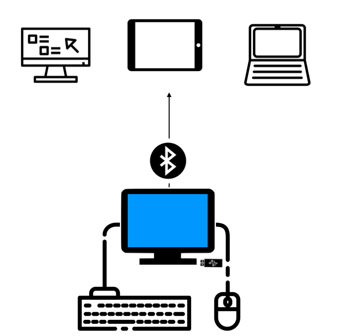

# ⚙️ Installation

> The easiest way to get up-and-running is with the [Windows Installer](https://github.com/AceCentre/RelayKeys/releases/latest), which includes the RelayKeys-CLI, and the RelayKeys-Desktop software. Read on to see how to install and setup.

## A quick reminder of how this works

So RelayKeys consists of a hardware solution that talks Bluetooth HID to secondary devices - anything that can pair with bluetooth and understand a keyboard works, and some software on the 'server' device; i.e. the device sending the key/mouse movements. So for our installation we really focus on the 'server' since the recieving device needs no additional hardware or software.

## Requirements

RelayKeys is designed to work on Windows, Linux, and Mac Operating Systems. We have built a Windows installer that makes the process easier on that platform. For Mac & Linux, you will need to build the app from the source.

* **Windows 7-10**
* **A USB Port**
* **Ability to Install the software as Administrator**
* **A second device to connect to** Could be a Windows computer, a Mac, an iPad etc

and most importantly:

* **A supported piece of RelayKeys-ready hardware**
  * Right now: this is designed to work with the [Adafruit nrf52840 express](https://www.adafruit.com/product/4062), [Adafruit nrf52840 Itsybitsy](https://www.adafruit.com/product/4481) or  [Raytac nrf52840 dongle](https://www.adafruit.com/product/5199) Others will be added to the list as this is developed.


If you have a RelayKeys stick provided by AceCentre, Carry on reading below. If you wish to buy your hardware that hasn't been prepared, [read this guide](developers/supported-boards.md).


## Download and Setup

Download the installer from [here](https://github.com/AceCentre/RelayKeys/releases/latest). When downloaded 'Run' the program

Step through the install procedure. Select 'Normal install' and let the RelayKeys setup software do its thing to install the software in the correct place (By default: `C:\Program Files (x86)\Ace Centre\RelayKeys`).


If you use 'Portable' or change the location of the software: Make a note of where you have stored the programme as you will need this when linking it with your software


## Plug-in Your RelayKeys stick & pair with a computer (Wired mode)

1. Make sure the Micro-USB connector is attached to the stick and then attach the female end of the USB lead into your computer
2. You should see your stick light a solid blue ("Paired") or flashing blue ("Un-paired")

If "Flashing". This means you have yet to pair the RelayKeys device with another computer.

### Put RelayKeys into a pairing mode

You can do this in three different ways:

* Send a command using the "`relaykeys-QT.exe`" app and press "Add a device" in the toolbar - or -
* Run "`relaykeys-cli.exe ble_cmd:devadd" - or -`
* Press the Button on the RelayKeys hardware. It will now flash <mark style="background-color:yellow;">yellow</mark>
* Next pair your device with RelayKeys.

### Pair with a Windows Computer

So to connect to Another Windows computer, go to Settings, Bluetooth, "Add a device", and connect to "AceRK"

### Pair with an iOS device

To connect to an iPad/iPhone, go to Settings, Bluetooth and add "Bluefruit52" or "AceRK" or "RelayKeys"\

### Pair with a Mac

To connect to a mac, Open up "System Preferences", Bluetooth and add "AceRK"

## Wireless mode


Note that this mode is useful on devices where you can't plug anything into your device. The setup can feel _strange -_ what we need to do is tell your relaykeys hardware the device to connect to.


1. Plug in device and follow instructions [as above](installation.md#plug-in-your-relaykeys-stick-and-pair-with-a-computer-wired-mode)
2. Pair the main AAC/Host device with it. So pair the computer you have attached it to with RelayKeys hardware. This can feel a bit strange - you are connecting the hardware to the same machine you are on. See [here](installation.md#undefined-1) for how to put it into pairing mode.
3. Disconnect the relaykeys hardware. In your bluetooth settings you actually need to click on the item and "Remove" device. (NB: If you cant do this it might be because you need to be an admin. The trick is open the Control Panel -> Devices & Printers -> Relaykeys -> Right click, Remove and you will be asked for an Admin password)
4. Plug relaykeys into a power source - away from the computer. Your RelayKeys may have a battery or you might need to plug into a wall USB power source.
5. Double press the User switch It should now shine a nice <mark style="color:blue;">blue</mark> colour!
6. Run RelayKeysd with `--ble_mode` See [here](developers/relaykeys-daemon.md) for more details

## Checking it works

1. Open up something on the second computer that you can enter text into. E.g. Notes on the iPad, Notepad on Windows or Notes on a mac
2. On your server computer (the one with RelayKeys attached) run "RelayKeys" (search for it in your Windows search bar). Alternatively find it in `C:\Program Files(x86)\Ace Centre\RelayKeys\relaykeys-qt.exe`
3. With the window having focus - type into it. You should see the keystrokes appear on the second computer

## Using it with your AAC software

You can get going by using one of these example files that work with your AAC Software:

* [The Grid 3](guides/grid3.md)
* [MindExpress](guides/mindexpress.md)
* [Tobii Communicator](guides/communicator.md)
* [Tobii Dynavox Snap](guides/snap-corefirst.md)

When you are ready, [have a read of how to integrate the features you need](../guides/basic-principles.html).

***

👍 You've successfully installed and setup RelayKeys! Now you may want to use the CLI or QT program. Read on to find out how these work.

😞 Got a problem? Dang! See our [troubleshooting](troubleshooting.md) guide.
