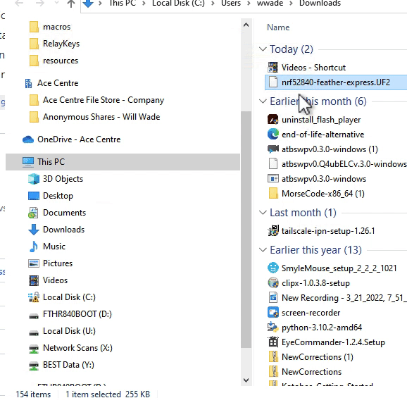

# Raytac dongle

Either use the drag and drop UF2 method or more steps involved - Arduino uploading method.\
\
For the UF2 method

* Download the UF2 file for the raytac dongle in the\_ [_current release_](http://github.com/acecentre/relaykeys/releases/latest)\_\_
* Press and hold thr reset button as you plug it into the computer. You will then get a USB drive on your computer. Drag and drop the UF2 file to the root of that drive.

Or the Arduino uploading method.

* Check the setup of your [Arduino IDE](https://learn.adafruit.com/bluefruit-nrf52-feather-learning-guide/arduino-bsp-setup) (remember we're using the nRF52840 board!)
* Upload the [sketch](../../../arduino/arduino\_nRF52840/arduino\_nRF52840.ino) to your feather.
* Run the server side code
* Done!
