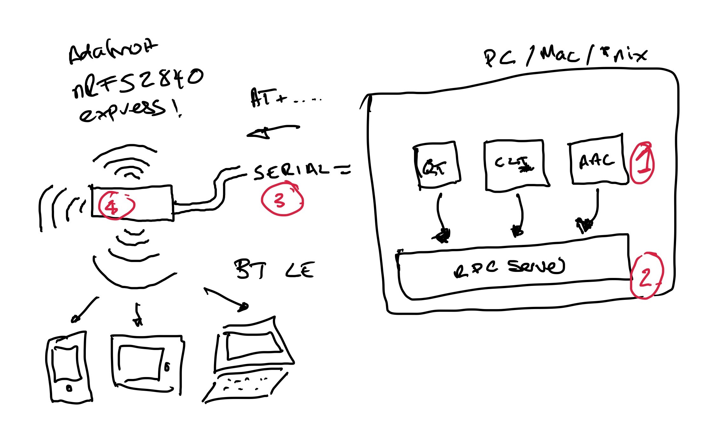

Architecture of RelayKeys
===========================

RelayKeys is a mixture of a Open Hardware board that communicates in Bluetooth LE (4), a RPC server (2) to communicate over serial to the board (3) and then RPC clients (1) such as the relaykeys-cli and relaykeys-qt applications. The Arduino based board is currently a **Adafruit nrf52840 express**. We use this board as it has very nice low level **AT** Commands we can talk to emulate **all** keyboard keys and their modifiers - as well as functions found on other common BT LE devices such as media keys. In short, **Adafruit have done the hardwork for us and its reliable**. 

## RPC-Service details

## AT Command structure 