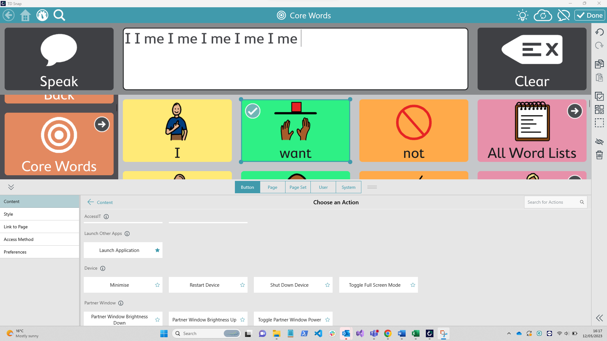

# Tobii Dynavox - Snap

Before you look at using RelayKeys with Snap have you considered [AccessIT 3](https://www.tobiidynavox.com/products/accessit-3)? Its available for TD software and is good! There are some snags - its not multi device compatible and does require the dongle being plugged in.&#x20;

## Adding an action - calling relaykeys

You need to edit your snap pageset - and create a "General" button - then you can add an action to a button. The action&#x20;

<figure><figcaption></figcaption></figure>

<figure><figcaption></figcaption></figure>

<figure><figcaption></figcaption></figure>
